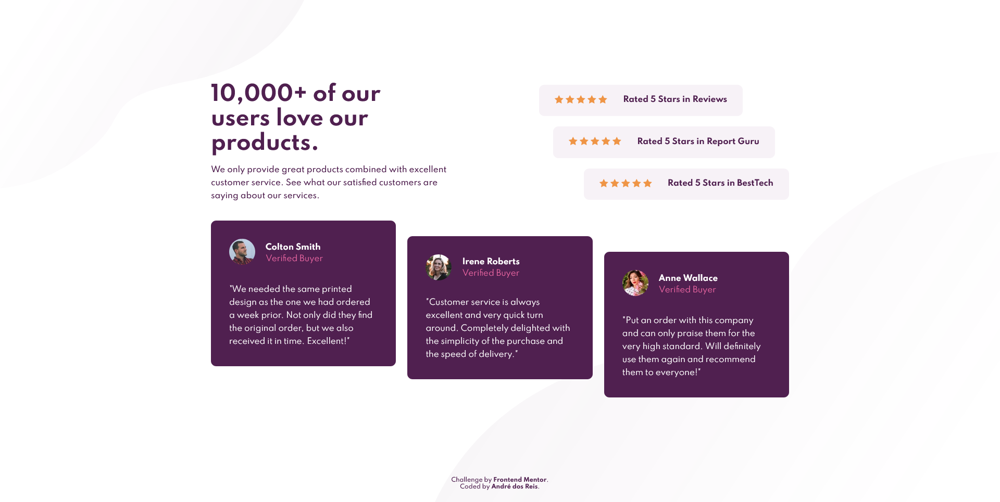

# Frontend Mentor - Social proof section solution

This is a solution to the [Social proof section challenge on Frontend Mentor](https://www.frontendmentor.io/challenges/social-proof-section-6e0qTv_bA). Frontend Mentor challenges help you improve your coding skills by building realistic projects. 

## Table of contents

- [Overview](#overview)
  - [The challenge](#the-challenge)
  - [Screenshot](#screenshot)
  - [Links](#links)
- [My process](#my-process)
  - [Built with](#built-with)
  - [What I learned](#what-i-learned)
  - [Useful resources](#useful-resources)
- [Author](#author)
- [Acknowledgments](#acknowledgments)

## Overview

### The challenge

Users should be able to:

- View the optimal layout depending on their device's screen size
- See hover states for interactive elements

### Screenshot



### Links

- [Solution URL](https://github.com/andrebdosreis/FEM-NEW-social-proof-section-master)
- [Live Site URL](https://andrebdosreis.github.io/FEM-NEW-social-proof-section-master)

## My process

### Built with

- Semantic HTML5 markup
- CSS custom properties
- Flexbox
- Mobile-first workflow

### What I learned

I studied some CSS FlexBox techniques to align items:

```css
.rating.left {
align-self: flex-start;}

.rating.right {
align-self: flex-end;}
```

The challenge's design has a lot of details and items, so I had to put some @media-queries to adjust items on screen 1024px, 768px, 425px and 320px. 


### Useful resources

- [B7 Web](https://www.b7web.com.br) - B7Web is an online web developer course from Brazil. So i learned how to write HTML and CSS codes studying B7Web's classes.


## Author

- Website - [André dos Reis](https://www.andredosreis.com.br)
- Frontend Mentor - [@andrebdosreis](https://www.frontendmentor.io/profile/andrebdosreis)
- Twitter - [@andrebdosreis](https://www.twitter.com/andrebdosreis)

## Acknowledgments

Thanks FrontEndMentor.io for challenge. I'm learning a lot with you.
